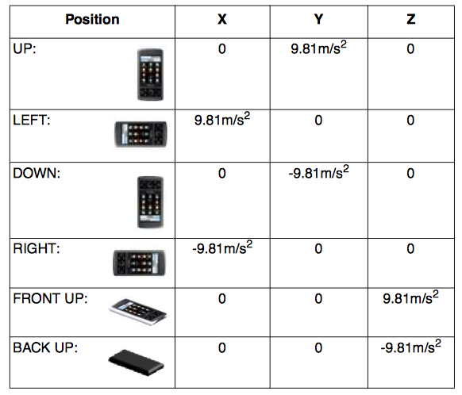

# Sensor.TYPE_ACCELEROMETER

All values are in SI units (m/s^2) and measure the **acceleration of the device minus the force of gravity**.

Acceleration sensors return sensor events for all 3 axes at a constant rate defined by `setDelay()`.

* x: Acceleration on the x-axis
* y: Acceleration on the y-axis
* z: Acceleration on the z-axis

>**Note that the readings from the accelerometer include the acceleration
due to gravity (which is opposite to the direction of the gravity vector).**

**Examples:**
* The norm of `<x, y, z>`  should be close to 0 when in free fall.
* When the device lies flat on a table and is pushed on its left side
toward the right, the x acceleration value is positive.
* When the device lies flat on a table, the acceleration value is +9.81,
which correspond to the acceleration of the device (0 m/s^2) minus the
force of gravity (-9.81 m/s^2).
* When the device lies flat on a table and is pushed toward the sky, the
acceleration value is greater than +9.81, which correspond to the
acceleration of the device (+A m/s^2) minus the force of
gravity (-9.81 m/s^2).

Table 1 lists the acceleration values read from the sensor corresponding to each position of a device.

*Table 1: [Acceleration Values on each Axis for Different Positions](http://cache.freescale.com/files/sensors/doc/app_note/AN4317.pdf)*